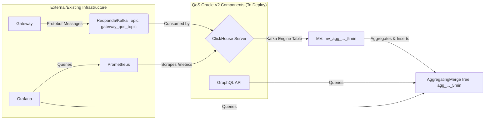

# QoS Oracle V2

## Overview

QoS Oracle V2 is a data pipeline and reporting system for The Graph Network quality metrics. It collects, processes, and exposes quality-of-service data from Gateway nodes, providing valuable insights into indexer performance and network health.

## Architecture & Data Flow

The system processes data in the following sequence:

1.  **Gateway:** External Gateway nodes (deployed separately) produce Protobuf-encoded QoS messages containing details about client queries and indexer interactions.
2.  **Redpanda/Kafka (`gateway_qos_topic`):** These messages are published to a central Kafka topic, typically named `gateway_qos_topic`. In production, this is usually an existing, managed Kafka cluster (like Redpanda).
3.  **ClickHouse (`kafka_qos_data` -> MVs -> Aggregates):** The ClickHouse server consumes messages from the `gateway_qos_topic` via a Kafka Engine table (`kafka_qos_data`). Materialized Views (MVs) trigger automatically to process these raw messages, calculating aggregates and storing them efficiently in AggregatingMergeTree tables (e.g., `agg_deployment_5min`, `agg_indexer_5min`, etc.) at a 5-minute granularity.
4.  **GraphQL API:** The GraphQL API service queries the aggregated tables in ClickHouse (using the final Views like `deployment_aggregations_hourly`) to serve requests for QoS metrics over different time intervals (5min, hourly, daily).
5.  **Monitoring (Prometheus & Grafana):**
    *   Prometheus (typically an existing instance) scrapes metrics directly from the ClickHouse server's `/metrics` endpoint (port 9363 by default).
    *   Grafana (typically an existing instance) queries Prometheus for ClickHouse operational metrics and can also query the ClickHouse aggregated tables directly for QoS metric dashboards.



## Features

- High-throughput data ingestion (via Kafka/Redpanda)
- Efficient storage with automatic TTL for raw data (managed by ClickHouse)
- Pre-aggregated metrics in 5-minute, hourly, and daily intervals
- Flexible GraphQL API for querying aggregated data with filtering, sorting, and time range selection
- Docker-based deployment for easy local development setup
- Configurable via environment variables for production deployments

## Getting Started (Local Development)

This section describes how to run the *entire* stack locally using Docker Compose, including dependencies like Redpanda and a test data producer. **This is intended for development and testing purposes only.** For production deployment guidance, see the "Production Deployment (Kubernetes/Helm)" section.

### Prerequisites

- Docker and Docker Compose (v2 recommended)
- Git
- 4+ CPU cores recommended
- 16+ GB RAM recommended
- 250+ GB SSD storage recommended

### Installation

1.  Clone the repository:
    ```bash
    git clone https://github.com/graphops/qos-oracle.git # Or your repo URL
    cd qos-oracle
    ```

2.  Start the services (Development profile includes API, DB, Kafka, and Test Producer):
    ```bash
    # Ensure you are in the root qos-oracle directory
    docker compose -f oracle/docker-compose.yml --profile dev up --build -d
    ```
    *   Use `--profile deps` to start only ClickHouse and Redpanda.
    *   Use `--profile all` to start everything including monitoring tools.

3.  Verify the installation:
    ```bash
    # Check API health
    curl http://localhost:8000/health
    # Check running containers
    docker compose -f oracle/docker-compose.yml ps
    ```

4.  Access the GraphQL endpoint at `http://localhost:8000/graphql`.

## Production Deployment (Kubernetes/Helm)

This section provides guidance for deploying the QoS Oracle V2 components into a production Kubernetes environment, likely managed via Helm, assuming existing infrastructure for Kafka, Prometheus, and Grafana.

### Components to Deploy

From the `oracle/docker-compose.yml` definition, you will need to create Kubernetes resources (Deployments, Services, ConfigMaps, etc.) for:

1.  **`clickhouse-server`:** The core data processing and storage engine.
2.  **`graphql-api`:** The service exposing the aggregated data.

### Components NOT to Deploy (Assuming Existing Infrastructure)

You will likely **not** deploy the following components if they already exist in your cluster:

*   `redpanda`: Use your existing Kafka/Redpanda cluster.
*   `test-producer`: This is only for development; real data comes from Gateways.
*   `prometheus`: Integrate with your existing Prometheus instance.
*   `grafana`: Integrate with your existing Grafana instance.
*   `redpanda-console`: Use existing tools or deploy if needed separately.

### Configuration (Environment Variables)

Configure the deployable components using environment variables, typically managed via Helm `values.yaml` or Kubernetes manifests.

**1. `clickhouse-server` Configuration:**

*   **Image:** `clickhouse/clickhouse-server:25.3` (or the version specified in `oracle/docker-compose.yml`)
*   **Initialization:** The standard ClickHouse Docker image executes `.sh`, `.sql`, and `.sql.gz` files found in `/docker-entrypoint-initdb.d/` upon initial startup. For production:
    *   You need to provide the necessary SQL schema definitions (defined in `oracle/clickhouse/tables.sql`) to create the `kafka_qos_data` table, Materialized Views (e.g., `mv_agg_deployment_5min`), and AggregatingMergeTree tables (e.g., `agg_deployment_5min`).
    *   Mount these SQL definition files into the `/docker-entrypoint-initdb.d/` directory within the container. This is typically done using a Kubernetes ConfigMap mounted as volume(s).
    *   **Crucially:** The `CREATE TABLE kafka_qos_data` statement within your mounted SQL file(s) must use the correct production values for `kafka_broker_list`, `kafka_topic_list`, `kafka_group_name`, and `kafka_schema`. You will likely need to template these values into the ConfigMap using Helm or a similar tool, rather than hardcoding them.
*   **Volume Mounts:**
    *   Mount your SQL initialization file(s) (e.g., from a ConfigMap) to `/docker-entrypoint-initdb.d/`. (This is the tables.sql file)
    *   Mount `oracle/clickhouse/schema.proto` to `/var/lib/clickhouse/user_files/schema.proto`. (The `kafka_schema` setting in your SQL should reference the relative path: `'schema.proto:qos.ClientQueryProtobuf'`).
    *   Mount necessary ClickHouse config XMLs (`settings.xml`, `users.xml`) to `/etc/clickhouse-server/config.d/` and `/etc/clickhouse-server/users.d/` respectively. Ensure `users.xml` defines the user/password needed by the GraphQL API.
*   **Ports:**
    *   `8123` (HTTP): For queries, health checks.
    *   `9000` (Native): For GraphQL API connection.
    *   `9363` (Metrics): For Prometheus scraping.
*   **Persistence:** Configure persistent storage for `/var/lib/clickhouse`.

**2. `graphql-api` Configuration:**

*   **Image:** Build the image using the Dockerfile at `oracle/graphql-api/Dockerfile`.
*   **Required Environment Variables:**
    *   `CLICKHOUSE_URL`: The endpoint for connecting to the ClickHouse native protocol (Ensure user/pass match ClickHouse config).
*   **Ports:**
    *   `8000` (API): Or the value set in the `PORT` env var.

### Monitoring Integration

**1. Prometheus Scrape Configuration:**

Add the following job to your Prometheus configuration to scrape metrics from the deployed ClickHouse service:

```
scrape_configs:
  - job_name: 'clickhouse-qos-oracle'
    metrics_path: /metrics
    static_configs:
      - targets: ['<clickhouse-service-name>:9363'] # Replace with your K8s service name and metrics port
    # Optional: Add labels specific to your environment
    # relabel_configs:
    #   - source_labels: [__address__]
    #     target_label: instance
    #     replacement: '<your-instance-name>' # e.g., qos-oracle-clickhouse-prod
```

**2. Grafana Dashboard:**

*   The Grafana dashboard definition used in development is located in `oracle/grafana/dashboards/`.
*   Export this dashboard (if running locally) or retrieve the JSON file from the repository.
*   Import this JSON file into your production Grafana instance via the UI ("+" -> "Import").
*   **Important:** After importing, you may need to edit the dashboard's settings to ensure the "ClickHouse" data source points to your production ClickHouse instance (if the data source name differs from the one used in development) and the "Prometheus" data source points to your production Prometheus.

## Usage

### GraphQL API

The GraphQL API provides access to aggregated QoS metrics via three main queries: `deploymentAggregations`, `indexerAggregations`, and `allocationAggregations`.

**Endpoint:** `http://<graphql-api-service-name>:<port>/graphql` (Use the Kubernetes service endpoint in production)

**Key Arguments:**

- `interval: AggregationInterval` (Optional: `FiveMinutes`, `Hourly`, `Daily`. Default: `Hourly`)
- `timeRange: TimeRangeInput` (Optional: Defaults to last 24h. Requires `from` or `to` if provided)
  * `from: String` (Optional: RFC3339 or Unix timestamp string, inclusive)
  * `to: String` (Optional: RFC3339 or Unix timestamp string, exclusive)
- `filter: AggregationFilterInput` (Optional: Filter by IDs)
  * `gatewayId: String`
  * `subgraph: String` (Deployment ID)
  * `indexer: String` (Hex Address)
  * `allocation: String` (Hex Address)
- `limit: Int` (Optional: Default 1000, Max 10000)
- `sort: [QuerySpecific]SortInput` (Optional: Sort by field and direction)

**Example Queries:**

1.  **Get Hourly Deployment Aggregations (Default - Last 24 hours):**

    *   **cURL:**
        ```bash
        curl -X POST http://localhost:8000/graphql \
             -H "Content-Type: application/json" \
             -d '{
               "query": "{ deploymentAggregations { timeBucket subgraph gatewayId queryCount avgResponseTimeMs } }"
             }'
        ```
    *   **GraphQL:**
        ```graphql
        {
          deploymentAggregations {
            timeBucket
            subgraph
            gatewayId
            queryCount
            avgResponseTimeMs
          }
        }
        ```

2.  **Get Daily Indexer Aggregations for the Last 7 Days:**

    *   **cURL:**
        ```bash
        curl -X POST http://localhost:8000/graphql \
             -H "Content-Type: application/json" \
             -d '{
               "query": "{ indexerAggregations( interval: Daily, timeRange: { from: \"$(date -v-7d +%s)\" } ) { timeBucket indexer gatewayId queryCount avgFeeGrt avgSecondsBehind } }"
             }'
        ```
    *   **GraphQL:**
        ```graphql
        {
          indexerAggregations(
            interval: Daily,
            timeRange: { from: "PAST_7_DAYS_TIMESTAMP" } # Replace with actual timestamp
          ) {
            timeBucket
            indexer
            gatewayId
            queryCount
            avgFeeGrt
            avgSecondsBehind
          }
        }
        ```

3.  **Get Top 50 Allocations by Query Count (5-Minute Interval, Since Specific Time):**

    *   **cURL:**
        ```bash
        curl -X POST http://localhost:8000/graphql \
             -H "Content-Type: application/json" \
             -d '{
               "query": "{ allocationAggregations( interval: FiveMinutes, timeRange: { from: \"1698300000\" }, sort: { field: QueryCount, direction: Desc }, limit: 50 ) { timeBucket subgraph indexer gatewayId queryCount avgSecondsBehind } }"
             }'
        ```
    *   **GraphQL:**
        ```graphql
        {
          allocationAggregations(
            interval: FiveMinutes,
            timeRange: { from: "1698300000" },
            sort: { field: QueryCount, direction: Desc },
            limit: 50
          ) {
            timeBucket
            subgraph
            indexer
            gatewayId
            queryCount
            avgSecondsBehind
          }
        }
        ```

4.  **Get Hourly Deployment Aggregations Up To a Specific Time for a Gateway:**

    *   **cURL:**
        ```bash
        curl -X POST http://localhost:8000/graphql \
             -H "Content-Type: application/json" \
             -d '{
               "query": "query GatewayUntil($gwId: String!) { deploymentAggregations( timeRange: { to: \"2023-10-27T12:00:00Z\" }, filter: { gatewayId: $gwId } ) { timeBucket subgraph gatewayId queryCount avgResponseTimeMs } }",
               "variables": { "gwId": "gateway-mainnet-1" }
             }'
        ```
    *   **GraphQL (with variables):**
        ```graphql
        query GatewayUntil($gwId: String!) {
          deploymentAggregations(
            timeRange: { to: "2023-10-27T12:00:00Z" },
            filter: { gatewayId: $gwId }
          ) {
            timeBucket
            subgraph
            gatewayId
            queryCount
            avgResponseTimeMs
          }
        }
        ```
        *Variables:*
        ```json
        {
          "gwId": "gateway-mainnet-1"
        }
        ```

## Development

This section describes the local development environment setup.

### Project Structure

- `oracle/clickhouse/` - ClickHouse configuration, schema (`schema.proto`), init template (`init-db.sql.template`), and entrypoint (`entrypoint.sh`).
- `oracle/graphql-api/` - GraphQL API service (Rust)
- `oracle/test-producer/` - **Development only:** Test data generator (Rust)
- `oracle/docker-compose.yml` - **Development only:** Docker Compose configuration
- `oracle/prometheus/` - **Development only:** Prometheus configuration
- `oracle/grafana/` - **Development only:** Grafana provisioning and dashboard definitions

### Running in Development Mode

```
# From the root qos-oracle directory
docker compose -f oracle/docker-compose.yml --profile dev up
```

*(Add `-d` to run detached)*

This will start the core services (`clickhouse-server`, `graphql-api`), dependencies (`redpanda`), and the `test-producer` using the configuration in `oracle/docker-compose.yml`.

### Local Monitoring (Development Only)

When running with `--profile all` or `--profile deps`:

-   **GraphQL API Health:** `http://localhost:8000/health`
-   **GraphQL API Endpoint:** `http://localhost:8000/graphql`
-   **ClickHouse HTTP Interface:** `http://localhost:8123` (Credentials: `graphql`/`graphql_password` by default, see `oracle/docker-compose.yml` `x-clickhouse-env`)
-   **Redpanda Kafka API:** `localhost:9092`
-   **Prometheus UI:** `http://localhost:9090`
-   **Grafana UI:** `http://localhost:3000`
-   **Redpanda Console:** `http://localhost:8080`

## License

[Add license information here]

## Contributing

[Add contribution guidelines here]

## Acknowledgements

This project is maintained by [GraphOps](https://graphops.xyz) and is part of The Graph Network ecosystem.
